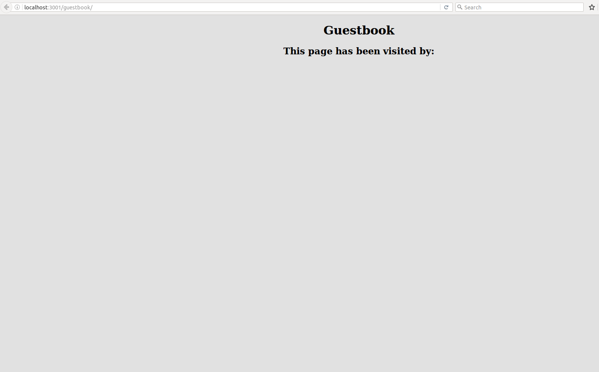

# Realtime Quick-Start

Developing a [Collaborative Real Time Editor](https://en.wikipedia.org/wiki/Collaborative_real-time_editor) is easier than ever!

You can find a list of useful repositories [here](./REPOSITORIES.md).

We're going to use some of them to produce a basic appliation that will familiarize you with the basics of writing software for real time collaboration.

This guide assumes you're using some kind of Unix-like operating system, Mac OSX or Linux-based distributions ought to work without problems.
Windows users may have to adapt instructions.

Let's get started!

### Setting up your Server

We'll be using **Chainpad-Server** as a back end for our app.

To get your server running, follow the [installation guide](https://github.com/xwiki-labs/chainpad-server#installation), and then launch your server using `node server.js`.

### Writing your App

We're going to build a **Realtime Guestbook**.
When somebody visits the page, they'll be prompted to input their name.
Once they've entered their name, it will be added to a list a of visitors.

The twist for this simple app is that the list of visitors is actually a realtime datastructure.
When a new visitor modifies the datastructure, other users' pages will update to reflect their changes.

If you look inside your server's `www/` directory, you'll find a `template/` directory, which contains two files:

* `index.html`
* `main.js`

Our application will use this same structure.


```BASH
# Navigate into the www/ directory, if you aren't already there
cd ./www/;

# Create a folder for your app
mkdir guestbook;

# Navigate into your new folder
cd guestbook;
```

#### Markup

Your next step is to create some basic HTML that you can view in your browser.

Using your favourite text editor, Open `index.html`, paste the following code into it, and save.

```
<!DOCTYPE html>
<html>
<head>
    <meta content="text/html; charset=utf-8" http-equiv="content-type"/>
    <meta name="viewport" content="width=device-width, initial-scale=1.0"/>
    <script data-main="main" src="/bower_components/requirejs/require.js"></script>
    <style>
        html, body{
            padding: 0px;
            margin: 0px;
            overflow: hidden;
            box-sizing: border-box;
            background-color: #e1e1e1;
        }
        body {
            width: 50vw;
            margin: auto;
        }
        h1, h2 { text-align: center; }
        pre { font-size:30px; }
    </style>
</head>
<body>
    <h1>Guestbook</h1>
    <h2>This page has been visited by:</h2>
    <pre id="visitors"></pre>

</body>
</html>
```

Assuming you're using the default configuration for your server, you should now be able to visit http://localhost:3001/guestbook/.

It should look something like this:



#### Javascript

The rest of our example app will consist entirely of Javascript, in a single file called `main.js`, located in the same `guestbook/` directory.

Once again, open up your favourite text editor and paste the following template into `main.js`:

```
define([
    /* DEPENDENCIES */
], function (/* MODULES */) {
    /* MAIN ROUTINE */

});
```

When you visit your web page, this module will be loaded by the script tag:

`<script data-main="main" src="/bower_components/requirejs/require.js"></script>`

`main.js` is a module which is compatible with _require.js_.

You can specify other modules as dependencies where it says `/* DEPENDENCIES */`.
They will be loaded and provided to your main program where it says `/* MODULES */`.

Let's start with dependencies...

```
define([

    /*  our server provides a configuration API, from which we can determine
        the URL of the websocket we will use */
    '/api/config?cb=' + Math.random().toString(16).slice(2),

    /*  this library creates a collaborative object */
    '/bower_components/chainpad-listmap/chainpad-listmap.js',

    /*  provide some cryptographic functions so that we can 
        pass information through the server without it being readable */
    '/bower_components/chainpad-crypto/crypto.js',
    '/bower_components/jquery/dist/jquery.min.js',

/*  the modules we've specified will be passed to our main routine as
    function arguments, as you can see below.

    We don't need to do anything with jQuery, as it's loaded into
    the global scope as `$` */
], function (Config, Listmap, Crypto) {
    /* MAIN ROUTINE */

});
```

Now we can work on the main routine.
The rest of our application's code will go in the function body located below the dependencies:

To start, we want to prompt our users to provide their name.
We'll assign their input to the variable `userName`:

```
], function (Config, Listmap, Crypto) {
    var userName = window.prompt("What is your name?");
```

Next we want to create our realtime object.

We need to specify a few configuration variables:

* the URL of the websocket it will use to communicate with other peers
* the channel id each peer will use to connect
* the encryption key
* an object of the type we'd like to use to collaborate
* our encryption module, which will encrypt messages before sending them to the server, and decrypt them when new messages are received

```
    var rt = Listmap.create({
        websocketURL: Config.websocketURL,
        channel: "b87dff2e9a465f0e0ae36453d19b087c",
        cryptKey:"sksyaHv+OOlQumRmZrQU4f5N",
        data:{},
        crypto: Crypto
    });
```

Just like that, we have a realtime object.
We can add properties to it, and our changes will be replicated to our peers.

You may have noticed that we specified the channel and cryptKey as unchanging strings.
This is because we want all users to visit the same guestbook.

In most cases users will want to be able to join distinct channels, and invite friends or colleagues to join their channels.
As an app author you'll need to choose a User Interface that works for your goals.
You can prompt users to enter a channel and password, or infer both by parsing the [fragment identifier](https://en.wikipedia.org/wiki/Fragment_identifier) from the page's URL, as is done in [Cryptpad](https://cryptpad.fr).

